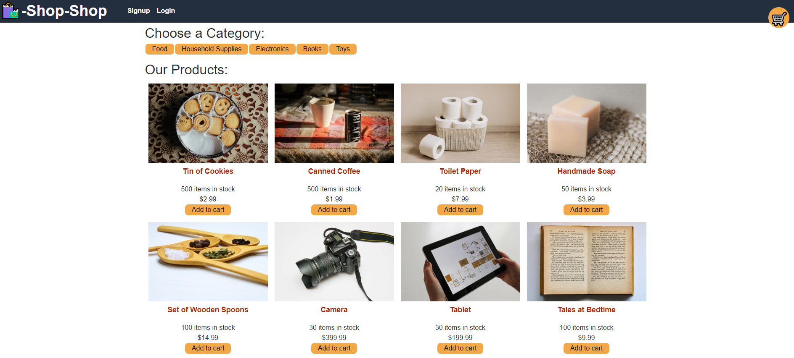

# Shop-Shop

E-commerce application built using the MERN-stack that allows users to sign-in and add products to a shopping cart and checkout items for purchase.

## Deployed Link

https://peaceful-springs-45091.herokuapp.com/

## Screenshot

## Technologies Used

* React (Context API)
* MongoDB
* GraphQL
* Node/Express
* Stripe (payment processing)

## User Story

* As a user, I want to be able to purchase products after signing into an application.

## Personal Note

The creation of this application helped me understand the usage of a global state, and how to differentiate between using React Context API and Redux.
